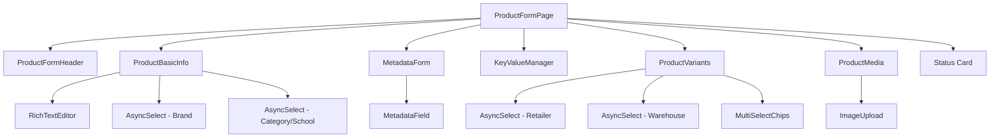

# ProductFormPage — Complete Context for Retailer Dashboard Replication

## Architecture Overview

The product form is a **single-page form** at [ProductFormPage.jsx](file:///d:/Projects/FullStack/Bukizz2/bukizz_react_dashboard/src/pages/products/ProductFormPage.jsx) that works in both **Create** and **Edit** modes (determined by the presence of `:id` in the URL via `useParams`). It uses a **3-column grid layout** (2 columns for main content, 1 column sidebar).

### Component Tree



---

## 1. API Endpoints Used

| # | Endpoint | Method | Purpose | When Called |
|---|----------|--------|---------|------------|
| 1 | `/products/{id}` | `GET` | Fetch product for edit mode | On mount if [id](file:///d:/Projects/FullStack/Bukizz2/bukizz_react_dashboard/src/components/ui/RichTextEditor.jsx#533-553) exists |
| 2 | `/products/comprehensive` | `POST` | Create new product | On form submit (create) |
| 3 | `/products/{id}` | `PUT` | Update existing product | On form submit (edit) |
| 4 | `/categories` | `GET` | Search categories for AsyncSelect | Typed search, `?page=1&limit=20&search=query` |
| 5 | `/categories/{id}` | `GET` | Fetch category's `productAttributes` | When category selection changes |
| 6 | `/schools` | `GET` | Search schools (filtered by city) | Typed search, `?page=1&limit=20&search=query&city=city` |
| 7 | `/brands` | `GET` | Search brands for AsyncSelect | Typed search, `?page=1&limit=20&search=query` |
| 8 | `/brands` | `POST` | Create a new brand inline | From "Add Brand" modal |
| 9 | `/users/admin/search` | `GET` | Search retailers | `?q=query&role=retailer` |
| 10 | `/warehouses/retailer/{retailerId}` | `GET` | Fetch warehouses for a retailer | When retailer is selected |
| 11 | `/warehouses/{id}` | `GET` | Fetch warehouse details (to get retailer in edit mode) | On edit load |
| 12 | `/images/upload` | `POST` | Upload images (product, variant, RTE, brand logo) | `multipart/form-data` with field `image` |

> [!IMPORTANT]
> For the **retailer dashboard**, you won't need endpoints 9 (search retailers) or 11 (warehouse by retailer) since the retailer is the logged-in user. The warehouse should be pre-filtered to the current retailer's warehouses.

---

## 2. All Form Fields & State

### Section A: Basic Info (`formData` state object)

| Field | Type | UI Control | Notes |
|-------|------|-----------|-------|
| `title` | `string` | `Input` text | **Required**. Product name |
| `sku` | `string` | `Input` text | Stock Keeping Unit, used to auto-generate variant SKUs |
| `brand` | `{id, label}` | `AsyncSelect` | Searchable dropdown, also has inline "Add New Brand" modal |
| `warehouse` | `{id, label}` | `AsyncSelect` | Depends on retailer selection. **Required** |
| `city` | `string` | `Input` text (general) / `Select` dropdown (school) | **Required** |
| `shortDescription` | `string` | `<textarea>` | Plain text, shown on product cards |
| `fullDescription` | `string` (HTML) | [RichTextEditor](file:///d:/Projects/FullStack/Bukizz2/bukizz_react_dashboard/src/components/ui/RichTextEditor.jsx#810-1542) | Returns styled HTML with `returnHtml={true}` |
| `basePrice` | `string` (number) | `Input` number | **Required**. Base price in INR |
| `compareAtPrice` | `string` (number) | `Input` number | Original/MRP price for discount calculation |

### Section B: Product Type & Context

| Field | Type | UI Control | Condition |
|-------|------|-----------|-----------|
| `productType` | `'general'` \| `'school'` | Radio buttons | Determines which context fields show |
| `category` | `Array<{id, label}>` | `AsyncSelect` (multi) | Only for `general` products |
| `school` | `{id, label}` | `AsyncSelect` | Only for `school` products, filtered by city |
| `grade` | `string` | `Select` dropdown | Only for `school` → `bookset` type |
| `isMandatory` | `boolean` | Checkbox | Only for `school` → `bookset` type |
| `schoolProductType` | `'bookset'` \| `'uniform'` \| `'stationary'` | `Select` dropdown | Only for `school` products |

### Section C: Product Options & Variants

| Field | Type | Notes |
|-------|------|-------|
| `productOptions` | `Array<{id, name, values, hasImages}>` | Max 3 options. Values can be strings or `{value, imageUrl}` |
| `variants` | `Array<{id, name, sku, price, compareAtPrice, stock, options}>` | Auto-generated from options via Cartesian product |
| `retailer` | `{id, label}` | **Required**. In retailer dashboard, this is the logged-in user |

### Section D: Media

| Field | Type | Notes |
|-------|------|-------|
| `images` | `Array<string \| File>` | Mix of URLs (existing) and File objects (new). Uploaded on submit |

### Section E: Product Highlights

| Field | Type | Notes |
|-------|------|-------|
| `highlights` | `Array<{key, value}>` | Key-value pairs. Key max 15 chars, value max 40 chars, max 10 items |

### Section F: Category Attributes

| Field | Type | Notes |
|-------|------|-------|
| `categoryAttributes` | `Array<attribute schema>` | Fetched from category's `productAttributes` |
| `metadata` | `Object` | Dynamic key-value pairs based on category attribute schema |

---

## 3. Options & Variant System — Detailed Walkthrough

### 3.1 Adding Options

There are **two types** of options:

1. **Text Options** — "Add Option" button → creates `{id, name: '', values: [], hasImages: false}`
2. **Image Options** — "Add Option with Image" button → creates `{id, name: '', values: [], hasImages: true}`

**Max 3 options** allowed (maps to `option1`, `option2`, `option3` in the API).

#### Text Option Values
Uses `MultiSelectChips` — type a value and press Enter. Values are stored as simple strings like `['S', 'M', 'L']`.

#### Image Option Values
Each value is `{value: string, imageUrl: string}`. User types a name, selects a file, and it uploads to `/images/upload` (with `bucket: 'products'`, `folder: 'variant'`). The uploaded URL is stored alongside the value.

### 3.2 Variant Generation (Cartesian Product)

The [generateVariants](file:///d:/Projects/FullStack/Bukizz2/bukizz_react_dashboard/src/pages/products/ProductFormPage.jsx#L437-L507) function creates all combinations automatically:

```
Options: Size=[S, M], Color=[Red, Blue]
↓ Cartesian Product
Variants: S/Red, S/Blue, M/Red, M/Blue
```

**Key behaviors:**
- **If no options** → creates a single "Default Variant" with the base price
- **Auto-generates SKU** per variant: `{baseSKU}-{value1}-{value2}`
- **Preserves user edits** — when options change, existing variant prices/stock/SKU are preserved (matched by name)
- **Triggers via `useEffect`** — watches `productOptions`, `formData.basePrice`, `formData.compareAtPrice`, `formData.sku`

### 3.3 Variant Table Columns

| Column | Editable | Notes |
|--------|----------|-------|
| Variant Name | No | Auto-generated, e.g. "S / Red" |
| SKU | Yes | Auto-generated but editable |
| Compare At (₹) | Yes | MRP/original price |
| % Discount | Yes | **Bidirectional** — calculated from compareAt & price, OR user edits discount which recalculates price |
| Price (₹) | Yes | Selling price |
| Stock | Yes | Inventory count |

### 3.4 Discount Calculation

```javascript
// Display: discount = ((compareAt - price) / compareAt) * 100
// Edit discount: price = compareAt * (1 - discount/100)
```

### 3.5 Edit Mode — Reconstructing Options from Variants

In edit mode, options are **reconstructed** from variant data using `option_value_1_ref`, `option_value_2_ref`, `option_value_3_ref` on each variant. The [processOptionPosition](file:///d:/Projects/FullStack/Bukizz2/bukizz_react_dashboard/src/pages/products/ProductFormPage.jsx#L180-L218) helper extracts unique values and their images for each position.

---

## 4. Rich Text Editor (RTE) — Detailed Walkthrough

Built on **TipTap** (`@tiptap/react`) at [RichTextEditor.jsx](file:///d:/Projects/FullStack/Bukizz2/bukizz_react_dashboard/src/components/ui/RichTextEditor.jsx). It is 1544 lines and highly customized.

### 4.1 Props

| Prop | Type | Usage |
|------|------|-------|
| `label` | `string` | Label above the editor |
| `value` | `string` | HTML content (or plain text if `returnHtml` is false) |
| [onChange](file:///d:/Projects/FullStack/Bukizz2/bukizz_react_dashboard/src/components/products/ProductVariants.jsx#40-48) | [(content) => void](file:///d:/Projects/FullStack/Bukizz2/bukizz_react_dashboard/src/pages/products/ProductFormPage.jsx#463-477) | Called on every edit |
| `returnHtml` | `boolean` | If `true`, returns **HTML with embedded CSS styles**. If `false`, returns plain text. The ProductForm uses `returnHtml={true}` |
| `error` | `string` | Error message to display |

### 4.2 TipTap Extensions Used

| Extension | Feature |
|-----------|---------|
| `StarterKit` | Bold, Italic, Paragraphs, Headings, Lists, etc. |
| `Underline` | Underline text formatting |
| [Link](file:///d:/Projects/FullStack/Bukizz2/bukizz_react_dashboard/src/components/ui/RichTextEditor.jsx#607-618) | Clickable links (opens prompt for URL) |
| [Table](file:///d:/Projects/FullStack/Bukizz2/bukizz_react_dashboard/src/components/ui/RichTextEditor.jsx#933-945), `TableRow`, `TableHeader`, `TableCell` | Resizable tables |
| **Custom [ResizableImage](file:///d:/Projects/FullStack/Bukizz2/bukizz_react_dashboard/src/components/ui/RichTextEditor.jsx#39-178)** | Images with drag-to-resize handles |
| **Custom `ImageGridNode`** | Image grids with configurable layouts |
| `Placeholder` | Placeholder text when editor is empty |

### 4.3 Toolbar Buttons

Bold, Italic, Underline | H1, H2 | Bullet List, Ordered List | Link, Image, Table, Image Grid | Undo, Redo

### 4.4 Image Upload in RTE

1. User clicks Image button → hidden `<input type="file">` opens
2. File is uploaded to `/images/upload` via `multipart/form-data`
3. Returned URL is inserted as a **ResizableImage** node
4. User can drag handles to resize the image within the editor

### 4.5 Image Grid

1. User clicks Grid button → Grid Dialog opens
2. User selects a **layout**: `2x1`, `2x2`, `3x1`, `2x3`, `3x2`, `3x3`
3. User uploads multiple images (each uploaded to `/images/upload`)
4. Clicking "Insert Grid" creates an `imageGrid` node with the selected layout
5. Grid supports: drag-to-reorder images, remove individual images, resize the grid, change layout after insertion

### 4.6 Table Insertion

1. User clicks Table button → Table Dialog opens
2. User sets Rows (1-10) and Columns (1-10)
3. Creates a resizable table with header row

### 4.7 HTML Output with Embedded Styles

The [wrapHtmlWithStyles()](file:///d:/Projects/FullStack/Bukizz2/bukizz_react_dashboard/src/components/ui/RichTextEditor.jsx#731-809) function wraps the output HTML with a `<style>` tag containing CSS for grids, tables, images, and typography. This ensures the content renders correctly on external platforms (mobile apps, websites).

---

## 5. Submit Payload Structure

The full payload sent to `POST /products/comprehensive` or `PUT /products/{id}`:

```javascript
{
  replaceVariants: false,
  replaceImages: false,
  retailerId: "uuid",          // In retailer dashboard: logged-in user's ID

  productData: {
    title: "Product Name",
    sku: "PROD-001",
    productType: "general",    // or "bookset", "uniform", "stationary"
    basePrice: 999,
    compareAtPrice: 1299,
    shortDescription: "Brief text",
    description: "<style>...</style><p>HTML content from RTE</p>",
    city: "New Delhi",
    currency: "INR",
    highlight: { "Material": "Cotton", "Size": "Regular" },
    metadata: {
      categoryAttributes: { /* dynamic fields from category schema */ },
      compare_price: 1299      // compareAtPrice of highest-discount variant
    },
    isActive: true
  },

  productOptions: [{
    name: "Size",
    values: [{ value: "S", imageUrl: null }, { value: "M", imageUrl: null }],
    position: 1,
    isRequired: true
  }],

  variants: [{
    sku: "PROD-001-S",
    price: 999,
    compareAtPrice: 1299,
    stock: 50,
    weight: 0.2,
    option1: "S",              // Value for position 1 option
    option2: null,             // Value for position 2 option
    option3: null,             // Value for position 3 option
    metadata: {}
  }],

  images: [{
    url: "https://...",
    altText: "Product Name",
    sortOrder: 0,
    isPrimary: true
  }],

  warehouseData: { type: "existing", warehouseId: "uuid" },
  brandData: { type: "existing", brandId: "uuid" },

  categories: [{ id: "uuid" }],    // For general products

  schoolData: {                     // For school products (null otherwise)
    schoolId: "uuid",
    grade: "5th",
    mandatory: true
  }
}
```

---

## 6. Key Differences for Retailer Dashboard

> [!TIP]
> Here's what changes when building this for the retailer dashboard:

| Area | Admin Dashboard | Retailer Dashboard |
|------|----------------|-------------------|
| **Retailer Select** | `AsyncSelect` searching all retailers | **Not needed** — use logged-in user's ID |
| **Warehouse Select** | First pick retailer, then warehouse | Directly show current retailer's warehouses |
| **Product Approval** | Products are active immediately | May need an approval workflow (`isActive: false` initially) |
| **Brand Creation** | Inline "Add New Brand" modal | May keep or remove depending on permissions |
| **School Products** | Full school product support | May not be needed for retailer dashboard |
| **API Auth** | Admin token | Retailer token — ensure backend accepts retailer role |

---

## 7. Reusable UI Components Needed

| Component | Source | Purpose |
|-----------|--------|---------|
| `Input` | `../ui` | Standard text/number input with label |
| `Select` | `../ui` | Static dropdown |
| `AsyncSelect` | `../ui` | Searchable dropdown that loads options from API |
| `MultiSelectChips` | `../ui` | Tag-style input for option values |
| [RichTextEditor](file:///d:/Projects/FullStack/Bukizz2/bukizz_react_dashboard/src/components/ui/RichTextEditor.jsx#810-1542) | `../ui` | Full WYSIWYG editor (TipTap-based) |
| [ImageUpload](file:///d:/Projects/FullStack/Bukizz2/bukizz_react_dashboard/src/components/ui/RichTextEditor.jsx#946-978) | `../ui` | Drag-and-drop multi-image upload |
| [Button](file:///d:/Projects/FullStack/Bukizz2/bukizz_react_dashboard/src/components/ui/RichTextEditor.jsx#619-640) | `../ui` | Standard button with loading state/icon |
| `ToastContext` | `../../context/ToastContext` | Toast notifications via `useToast()` |
